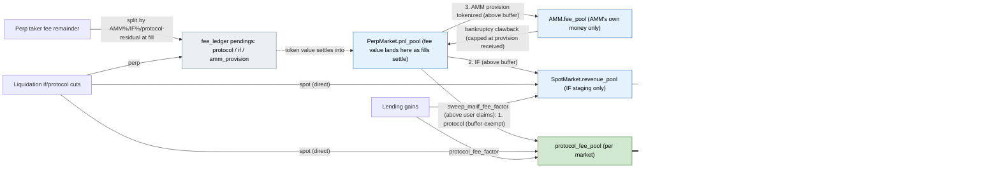
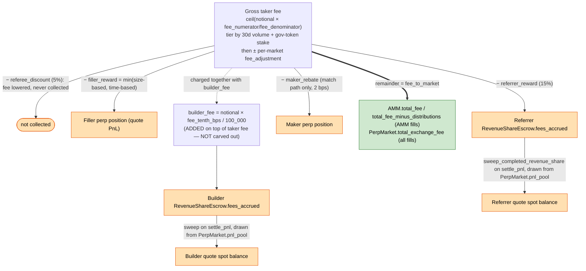
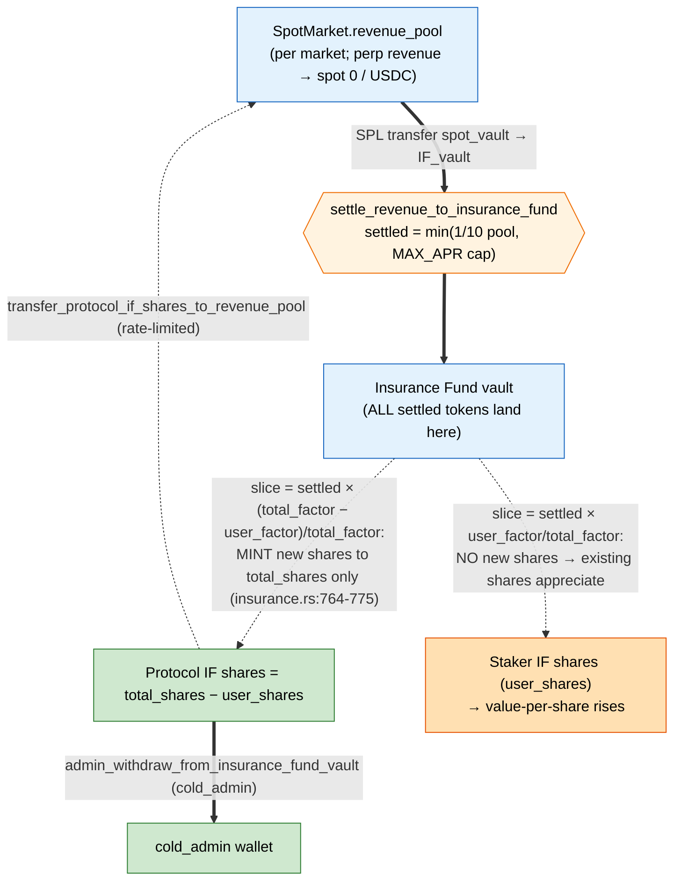

# Fees & Revenue

This document has two parts:

- **[NEW](#new--explicit-fee-carveouts-current-system)** — the current fee
  system (June 2026 redesign): explicit per-source protocol/IF carveouts, a
  directly-withdrawable protocol fee pool, and a 100% staker-owned insurance
  fund.
- **[OLD](#old--fee--revenue-flow-pre-redesign-historical)** — the previous
  insurance-fund-waterfall design and a snapshot of the original Drift mainnet
  deployment's settings, kept as historical context.

---

# NEW — Explicit fee carveouts (current system)

Design goals (vs. OLD): protocol fees are **not** part of the protocol's
backstop, are **directly withdrawable** on demand, and every fee source has an
**explicit** protocol/insurance split — no waterfall, no settlement-time
share-mint, no dual insurance fund.

## Trade-fee waterfall (perps)

One tiered taker fee; fixed carveouts off the top; the remainder split by two
global percentages; builder fee added on top.

```
taker_fee  = ceil(notional × fee_numerator / FEE_DENOMINATOR)   tiered by 30d volume + gov stake,
                                                                ± per-market fee_adjustment
          − referee_discount          (reduces what the taker pays; never collected)
          − referrer_reward           (→ referrer, via RevenueShareEscrow)
          − filler_reward             (→ keeper, as perp quote PnL)
          − maker_rebate              (→ maker; match path only)
          ───────────────────────────
remainder ── × amm_fee_numerator/100 → AMM fee provision (booked into the AMM's ledger at fill,
          │                                             tokenized into amm.fee_pool by the sweep;
          │                                             clawable in bankruptcy — the backstop of
          │                                             last resort, tracked in
          │                                             amm_protocol_fees_received)
          ── × if_fee_numerator/100  → insurance       (pending_if_fee → revenue_pool → IF vault)
          ── residual                → protocol        (pending_protocol_fee → protocol_fee_pool)

builder_fee = notional × fee_tenth_bps / 100_000   ADDED on top of taker_fee; pure pass-through
```

- The split lives on the global `FeeStructure` (`amm_fee_numerator` /
  `if_fee_numerator`, precision `FEE_PERCENTAGE_DENOMINATOR` = 100); the
  protocol is the **residual claimant**. Default: AMM 0%, IF 0% ⇒ protocol
  100%. `validate_fee_structure` enforces `amm + if ≤ 100%`.
- **The AMM books ONLY its own money**: `fee_to_market = amm_fee + spread
  surplus`. The protocol/IF carveouts never enter the AMM's ledger
  (`total_fee_minus_distributions`) or its token pool.
- AMM spread surplus (`quote_asset_amount_surplus` → `total_mm_fee`) is **not**
  part of the split — it remains the AMM's own income, and is NOT part of the
  bankruptcy-clawback tranche.
- DLOB matches split the same way; the AMM's provision is credited to its books
  (`apply_fill_fees`) and tokenized by the sweep.
- `calculate_fee_for_fulfillment_with_amm` / `_with_match`
  (`math/fees.rs`, `split_fee_remainder`).

## The fee ledger

Every per-market fee number lives in one embedded struct,
`PerpMarket.fee_ledger: FeeLedger` (`state/perp_market.rs`), written only
through its accessors:

| Field | Meaning |
|---|---|
| `total_exchange_fee` | lifetime **gross** taker fees (analytics; same convention on AMM and match paths) |
| `total_liquidation_fee` | lifetime liquidation fees charged (IF + protocol cuts; pure analytics) |
| `pending_protocol_fee` | protocol carveout accrued but not yet materialized |
| `pending_if_fee` | insurance carveout accrued but not yet materialized |
| `amm_protocol_fees_received` | cumulative AMM fee provision net of clawbacks — the bankruptcy backstop cap |
| `pending_amm_provision` | provision booked into the AMM's ledger at fill but not yet tokenized into `amm.fee_pool` (always ≤ `amm_protocol_fees_received`) |

Accessors: `accrue_fill_fees` / `accrue_liquidation_fees` (accrual),
`consume_pending_if` / `consume_pending_protocol` /
`consume_pending_amm_provision` / `consume_amm_backstop` (materialization and
bankruptcy draws).

## Accrual and materialization (perps)

Fee value materializes in the **pnl pool**: fees debit the payer's position at
fill, and the tokens arrive as fills settle. So carveouts accrue as **pending
counters** in the fee ledger and the streaming sweep drains them from the pnl
pool's surplus over live user claims — the AMM is never a conduit:

1. **At fill** (`controller/orders.rs`): all three carveouts accrue
   (`accrue_fill_fees`, which also records the gross taker fee). The AMM books
   only its own provision + spread surplus via `apply_fill_fees`.
2. **The sweep** (`sweep_market_fees`, `controller/perp_pools.rs`): every
   drain reserves `max(net_user_pnl, 0)` so live user claims stay fully
   backed. Waterfall:
   1. `pending_protocol_fee` → `PerpMarket.protocol_fee_pool` (withdrawable).
      **Buffer-exempt** and first: it sweeps every settle so each drain stays
      small, and its value is no bankruptcy tranche so retaining it buys
      nothing.
   2. `pending_if_fee` → quote `SpotMarket.revenue_pool` (→ IF vault)
   3. `pending_amm_provision` → tokenized into `amm.fee_pool` (the AMM's
      ledger was already credited at fill — this is a pure token transfer)
   Steps 2-3 additionally leave the `fee_pool_buffer_target` retention margin
   behind — the buffer throttles the outflows whose value the bankruptcy
   waterfall can still reach (an unswept IF cut even upgrades coverage:
   market-local tranche-1 forgiveness is uncapped, the shared vault is
   capped). Steps 1-2 never touch the AMM's books or pools. Un-drained
   remainders wait for the next sweep. This is the **only** fee routing out
   of a perp market.
   It runs inline on every pnl settle (`update_pool_balances`, after the
   user's settle so the sweep can't starve it) and on demand via the
   permissionless `sweep_perp_market_fees` keeper instruction, and emits
   `PerpMarketFeeSweepRecord`. `fee_pool_buffer_target` is per-market
   (initialized to 250 QUOTE, set via
   `update_perp_market_fee_pool_buffer_target`).
3. **No funding floor needed**: `total_fee_minus_distributions` contains only
   the AMM's own equity, so funding/repeg/k-updates may spend it down to zero
   (guards: the drawdown breaker and `is_underwater`). The old floors —
   pendings-based funding floor, `SHARE_OF_FEES_ALLOCATED_TO_DRIFT`,
   `protocol_floor` — are gone.

## Liquidations

Per-market rates (`LIQUIDATION_FEE_PRECISION` = 1e6): `liquidator_fee`,
`if_liquidation_fee`, and the new `protocol_liquidation_fee`.

- `liquidator_fee` → the liquidator, unchanged.
- The insurance-side budget is computed once with the existing margin-aware
  formula at cap `if_liquidation_fee + protocol_liquidation_fee`, then split
  **IF-first**: the IF receives exactly what it would have without the protocol
  fee; the protocol only captures margin headroom beyond it. The combined fee
  therefore stays inside the margin budget and can never push a liquidation
  into spurious bankruptcy (`calculate_perp_if_fee` / `calculate_spot_if_fee`,
  `math/liquidation.rs`).
- Perp: IF cut → `pending_if_fee`, protocol cut → `pending_protocol_fee`
  (`total_liquidation_fee` remains a lifetime analytics counter). Spot: IF cut
  → the liability market's `revenue_pool`, protocol cut → its
  `protocol_fee_pool`, both directly.

## The AMM as backstop of last resort

The `amm_fee_numerator` cut is a fee **provision** to the AMM with a string
attached: it is real, spendable AMM liquidity (no floor reserves it), but the
market tracks the cumulative amount in `fee_ledger.amm_protocol_fees_received`
and a perp bankruptcy claws back whatever is still recoverable. The resolution
waterfall (`resolve_perp_bankruptcy`, `controller/liquidation.rs`):

1. **`pending_if_fee`** — the market's own in-transit insurance fees,
   counter-only: the pending claim and the forgiven loss are both claims on
   future pnl-pool inflows, so canceling one against the other needs no token
   movement
2. **Insurance fund vault** (bounded by the market's `insurance_claim` caps;
   real tokens → pnl pool)
3. **Provision clawback** — capped at `amm_protocol_fees_received`, two
   phases: first the not-yet-tokenized `pending_amm_provision` (counter-only),
   then tokenized provision moves `amm.fee_pool → pnl_pool` (capped by what
   the fee pool actually holds). Both phases debit the AMM's books
   (`record_amm_pnl`) — the provision was credited at fill — and dent the
   drawdown breaker.
4. **Socialization** across counterparties

The AMM's own spread/trading capital beyond the provision is never tapped, and
the external LP pool (VLP constituent vaults) is untouched by bankruptcy
entirely. Because the clawback is best-effort (the AMM may have spent the
provision on curve costs), the cap is `min(amm_protocol_fees_received,
pending + fee-pool tokens)`.

## Lending

Two explicit carveouts on deposit-interest gains
(`update_spot_market_cumulative_interest`, `controller/spot_balance.rs`;
precision `IF_FACTOR_PRECISION` = 1e6, sum validated ≤ 100%):

- `InsuranceFund.if_fee_factor` → `revenue_pool` (staker-owned IF).
- `SpotMarket.protocol_fee_factor` → `protocol_fee_pool` (withdrawable).
- Lenders receive the rest. Set via `update_spot_market_if_factor`.

## Insurance fund: 100% staker-owned

- `revenue_pool` has exactly one purpose: staging IF fees. Its only exit is
  `settle_revenue_to_insurance_fund` (throttles unchanged: ≤ min(1/10 pool,
  MAX_APR cap) per period with stakers present).
- **No protocol shares.** The settle-time protocol mint, `total_factor` /
  `user_factor` split, `admin_withdraw_from_insurance_fund_vault`, and
  `transfer_protocol_if_shares_to_revenue_pool` are **removed**. 100% of every
  settle accrues to stakers as share-price appreciation. If the operating
  company wants IF exposure, it stakes like anyone else.
- **No-staker bootstrap:** while `total_shares == 0`, fees still build the
  backstop; the first settle (or first stake) seeds `total_shares` 1:1 with the
  vault so the first staker mints at share price ~1 instead of receiving 0
  shares. The seeded shares are protocol-owned, permanent, and
  **non-withdrawable** — pure backstop ballast.
- The IF still pays bankruptcies (`resolve_perp/spot_bankruptcy`) — it is the
  protocol's only backstop, and protocol fees are never part of it.

## Protocol fee custody and withdrawal

- `protocol_fee_pool: PoolBalance` on every market — a protocol-owned
  Deposit-type claim inside the existing spot vault (perp pools are
  quote/USDC-denominated against the quote spot market, like `pnl_pool`).
  Counted in `deposit_balance`; owned by the protocol, not users; never
  backstop.
- `withdraw_protocol_fees_spot(market_index, amount)` and
  `withdraw_protocol_fees_perp(market_index, amount)`
  (`instructions/protocol_fees.rs`):
  - **Authority:** the `FeeWithdraw` hot key (`HotRole::FeeWithdraw`, set via
    `update_hot_admin`) — supports e.g. a daily withdrawal bot.
  - **Recipient-locked:** funds go to the associated token account of the
    configured recipient — `State.protocol_fee_recipient_perp` for perp
    (quote) withdrawals, `State.protocol_fee_recipient_spot` for spot
    (per-market token) withdrawals — created on demand via `init_if_needed`;
    the `recipient` account is `address`-constrained to the state field.
    Each recipient is settable **only** by `cold_admin`
    (`update_protocol_fee_recipient(recipient, market_type)`). Unset
    recipient ⇒ that side's withdrawals are inert.
  - **Depositor-safe:** capped to the pool's own balance, and the vault must
    still cover all remaining claims afterwards
    (`validate_spot_market_vault_amount`) — a withdrawal can never tap user
    deposits.
- Emits `ProtocolFeeWithdrawRecord`.

## Flow diagram



## Reference

| Item | Location |
|---|---|
| Split numerators + validation | `FeeStructure.amm_fee_numerator`/`if_fee_numerator` (protocol = residual) (`state/state.rs`); `validation/fee_structure.rs` |
| Fee ledger | `PerpMarket.fee_ledger: FeeLedger` + accessors (`state/perp_market.rs`) |
| AMM provision / clawback cap | `fee_ledger.amm_protocol_fees_received` + `pending_amm_provision`; clawback in `resolve_perp_bankruptcy` |
| Waterfall math | `math/fees.rs` (`split_fee_remainder`, `FillFees.protocol_fee`/`if_fee`/`amm_fee`) |
| Pending counters | `fee_ledger.pending_protocol_fee`/`pending_if_fee`/`pending_amm_provision` |
| Streaming sweep | `sweep_market_fees` (`controller/perp_pools.rs`, source = pnl pool); inline via `update_pool_balances`, on demand via `sweep_perp_market_fees` (keeper); emits `PerpMarketFeeSweepRecord` |
| Sweep buffer | `PerpMarket.fee_pool_buffer_target` — pnl-pool retention above `max(net_user_pnl, 0)` for the IF/provision drains; the protocol drain is buffer-exempt (`update_perp_market_fee_pool_buffer_target`) |
| AMM ledger recompute | `calculate_perp_market_amm_summary_stats` (`math/perp_market.rs`): `tfmd = pools − net_user_pnl − pending_protocol − pending_if` |
| Dead post-isolation | funding/curve floors (`protocol_floor`, `SHARE_OF_FEES_ALLOCATED_TO_DRIFT`, pendings funding floor), `amm.total_fee_withdrawn` (frozen), the settle_pnl `fee_pool/5` buffer |
| Liquidation split | `controller/liquidation.rs` (perp ×2 + spot ×2 paths); rates on Perp/SpotMarket |
| Lending carveouts | `controller/spot_balance.rs:update_spot_market_cumulative_interest`; `InsuranceFund.if_fee_factor`, `SpotMarket.protocol_fee_factor` |
| IF bootstrap | `controller/insurance.rs` (`settle_revenue_to_insurance_fund`, `add_insurance_fund_stake`) |
| Withdrawal | `instructions/protocol_fees/`; `State.protocol_fee_recipient_perp`/`_spot` + `hot_fee_withdraw`; `HotRole::FeeWithdraw` |
| Admin setters | `update_perp/spot_market_liquidation_fee` (+protocol rate), `update_spot_market_if_factor` (if_fee_factor, protocol_fee_factor), `update_protocol_fee_recipient`, `update_perp/spot_fee_structure`, `update_perp_market_fee_pool_buffer_target` |
| Event | `ProtocolFeeWithdrawRecord`; `protocol_fee` on liquidation records |

---

# OLD — Fee & Revenue Flow (pre-redesign, historical)

> **Historical.** This part describes the fee system **before** the June 2026
> fee redesign (see the NEW section above). It is kept for context on what was
> replaced and why. None of the waterfall mechanics below remain on-chain:
> the `total_exchange_fee × ½` revenue sweep, the `total_factor`/`user_factor`
> settlement split, and protocol-owned IF shares are all gone.

Classifies every fee the protocol charges by destination: **protocol-retained revenue**, **pass-through** (forwarded to a user, keeper, or builder), **liability-offsetting** (insurance-fund inflows that pre-fund bankruptcy payouts), or **LP revenue**. This fork diverges from upstream Drift in the ways noted below.

## Differences from upstream Drift

- **Spot trading charges no fee.** The swap fee is hardcoded to zero (`let fee = 0_u64;`, `instructions/user.rs:3949`), and there is no spot order-book fill path (`fulfill_spot_order` does not exist); spot trades route through `begin_swap`/`end_swap` and `lp_pool_swap`. `SpotMarket.total_spot_fee`, `spot_fee_pool`, and `total_swap_fee` are therefore inert.
- **Perp taker fees are the only trading-fee revenue.**
- **The AMM lives in `src/vlp/`** (the decoupled AMM). Its fee counters (`total_fee`, `total_mm_fee`, `total_fee_minus_distributions`, `total_fee_withdrawn`, `fee_pool`) are on `vlp/amm/state.rs`, not `PerpMarket`; `lp_fee_transfer_scalar` is now `HedgeConfig.fee_transfer_scalar` (`vlp/hedge/state.rs:80`).
- **The protocol's automatic fee share is ½ of taker fees** (`SHARE_OF_FEES_ALLOCATED_TO_DRIFT = 1/2`, `math/constants.rs:111-112`). This bounds only the continuous revenue-pool sweep; AMM spread surplus and trading PnL are excluded from it and are realized at market wind-down instead (see [Protocol fee share](#protocol-fee-share-streaming-vs-wind-down)).

## Diagram 1 — Perp taker-fee decomposition

Carve-out order, in `math/fees.rs` (`calculate_fee_for_fulfillment_with_amm` `:36`, `calculate_fee_for_fulfillment_with_match` `:263`):



`fee_to_market` is the only protocol-retained component (green); the rest is forwarded to a user, keeper, or builder. `builder_fee` is additive — it does not reduce `fee_to_market` — and is paid from the perp `pnl_pool` at settlement.

## Diagram 2 — Value flow across pools

Each flow passes through an accounting ledger (tracks an amount, holds no tokens), one or more token pools (actual balances), and a settlement instruction (moves tokens).

Legend: gray = accounting ledger · blue = token pool · orange hexagon = settlement instruction · green = protocol-retained · light-orange = pass-through · red = liability/outflow. Solid arrow = token movement; dashed arrow = a ledger that bounds a settlement amount.

```mermaid
flowchart LR
    classDef ledger fill:#eceff1,stroke:#607d8b,color:#000;
    classDef pool fill:#e3f2fd,stroke:#1565c0,color:#000;
    classDef step fill:#fff3e0,stroke:#ef6c00,color:#000;
    classDef revenue fill:#cfe8cf,stroke:#2e7d32,color:#000;
    classDef passthru fill:#ffe0b2,stroke:#e65100,color:#000;
    classDef liability fill:#f8d7da,stroke:#c62828,color:#000;

    TK["Perp taker"]
    BR["Spot borrower"]
    PLQ["Perp liquidatee"]
    SLQ["Spot liquidatee"]

    TEF["total_exchange_fee +<br/>AMM.total_fee / total_fee_minus_distributions / total_fee_withdrawn"]:::ledger
    TLF["PerpMarket.total_liquidation_fee"]:::ledger
    ESC["RevenueShareEscrow.fees_accrued"]:::ledger
    QOL["AmmCache.quote_owed_from_lp_pool"]:::ledger

    FP["AMM.fee_pool"]:::pool
    PP["PerpMarket.pnl_pool"]:::pool
    RP["SpotMarket.revenue_pool (Deposit)<br/>perp revenue → spot 0 (USDC); spot revenue → own market"]:::pool
    IFV["Insurance Fund vault"]:::pool
    LPV["LP quote constituent vault"]:::pool

    S_FILL{{"fulfill_perp_order"}}:::step
    S_INT{{"update_spot_market_cumulative_interest"}}:::step
    S_SET{{"settle_pnl → update_pool_balances<br/>→ transfer_revenue_to_pool"}}:::step
    S_REV{{"settle_revenue_to_insurance_fund"}}:::step
    S_SWP{{"settle_pnl → sweep_completed_revenue_share"}}:::step
    S_LP{{"update_amm_cache + SettleAmmPnlToLp"}}:::step
    S_WD{{"admin_withdraw_from_insurance_fund_vault"}}:::step
    S_BK{{"resolve_perp / spot_bankruptcy"}}:::step
    S_EXP{{"settle_expired_market_pools_to_revenue_pool<br/>(market Settlement → Delisted)"}}:::step

    COLD["External protocol wallet"]:::revenue
    BLD["Builder / referrer spot balance"]:::passthru
    LIQ["Liquidator"]:::passthru
    LPH["LP token holders"]:::passthru
    STK["Staker IF claim"]:::passthru
    BD["Bankruptcy bad debt"]:::liability

    %% perp trading fee
    TK --> S_FILL
    S_FILL -->|"+= user_fee (gross)"| TEF
    S_FILL -->|"builder/referrer carve"| ESC
    S_FILL -.->|"hedge settle realizes AMM PnL+fees as tokens"| FP

    %% builder/referrer pass-through
    ESC --> S_SWP
    PP --> S_SWP
    S_SWP -->|"transfer_spot_balances out of pnl_pool"| BLD

    %% lending skim
    BR --> S_INT
    S_INT -->|"deposit_interest × total_factor / 1e6"| RP

    %% liquidations
    PLQ -->|"liquidator_fee (symmetric transfer)"| LIQ
    PLQ -->|"if_fee accrues"| TLF
    SLQ -->|"if_fee → update_revenue_pool_balances (direct)"| RP

    %% shared revenue-pool sweep
    TEF -.->|"½ floor gates amount"| S_SET
    TLF -.->|"min(·, quote_settled + quote_max_insurance) gates"| S_SET
    FP ==>|"reclassify Borrow→Deposit; only if surplus > 250Q,<br/>capped by ½×total_exchange_fee (excl. spread/PnL) & period cap"| S_SET
    S_SET ==> RP

    %% wind-down: protocol recovers 100% of residual (NOT capped at ½)
    FP ==>|"on expiry: withdraw_from_fee_pool (100% residual)"| S_EXP
    PP ==>|"on expiry: 100% residual"| S_EXP
    S_EXP ==> RP

    %% revenue → IF → protocol
    RP ==>|"reclassify Borrow + SPL transfer spot_vault→IF_vault"| S_REV
    S_REV ==> IFV
    IFV ==>|"protocol shares = total_shares − user_shares"| S_WD
    S_WD ==>|"cold_admin only, must leave ≥1 share"| COLD
    IFV -->|"user_factor slice raises staker claim"| STK
    IFV -.-> S_BK
    S_BK -.->|"SPL payout → pnl_pool / spot_vault; residual socialized"| BD

    %% LP routing
    TEF -.->|"fee_transfer_scalar % gates"| S_LP
    FP --> S_LP
    PP --> S_LP
    S_LP -->|"accrues, then settles to vault"| QOL
    QOL --> LPV
    LPV --> LPH
```



The protocol's only path to an external wallet is `fee_pool → revenue_pool → IF vault → protocol IF shares → cold_admin`, via `admin_withdraw_from_insurance_fund_vault` (`if_staker.rs:1241`, restricted to `state.cold_admin`, must leave ≥1 protocol share). `revenue_pool` has no direct admin withdrawal; it exits only to the IF (`settle_revenue_to_insurance_fund`) or to an underwater perp market (`update_pool_balances`; the negative branch is currently a no-op, `perp_pools.rs:179`).

## Protocol fee share: streaming vs wind-down

The ½ share bounds the continuous sweep, not the protocol's total claim on a market's fees.

| Path | When | Amount | Mechanism |
|---|---|---|---|
| Streaming sweep | Continuously, during `settle_pnl` | ≤ `½ × total_exchange_fee + liq_fees` lifetime (`total_fee_withdrawn`) | `proposed_revenue_outflow` (`amm/state.rs:409`); cap `total_fee_for_if = total_exchange_fee × ½` (`perp_pools.rs:81`, `repeg.rs:433`) |
| Fee↔PnL rebalance | Admin | None (internal) | `transfer_fee_and_pnl_pool` (`admin.rs:1141`) moves `fee_pool`↔`pnl_pool`; does not reach the revenue pool |
| Wind-down sweep | Market expired, balanced, after escrow | 100% of residual `fee_pool + pnl_pool` | `settle_expired_market_pools_to_revenue_pool` (`admin.rs:1083`, sweep `:1164-1190`) |

The streaming cap is keyed to `total_exchange_fee`, which accumulates only the explicit taker fee (`user_fee`, `orders.rs:2267`). AMM spread surplus (`taker_surplus → AMM.total_mm_fee`, `quoter.rs:170`) and AMM trading PnL accrue to `total_fee`/`total_fee_minus_distributions` and remain in `fee_pool` as retained equity, reaching the revenue pool only at delist. Higher AMM profitability raises `fee_pool` but not the streaming cap.

## Pools and ledgers

| Node | Kind | Holds tokens? | Role / classification |
|---|---|---|---|
| `total_exchange_fee`, `AMM.total_fee`, `total_fee_minus_distributions`, `total_fee_withdrawn` | Accounting ledger | No | Gate the revenue-pool sweep (protocol's ½ floor); `total_fee_withdrawn` = realized-revenue meter |
| `PerpMarket.total_liquidation_fee` | Accounting accumulator | No | Gates how much liq-fee may sweep, capped by `quote_max_insurance` |
| `RevenueShareEscrow.fees_accrued` | Accounting ledger | No | Builder/referrer amount owed; paid from `pnl_pool` |
| `AmmCache.quote_owed_from_lp_pool` | Accounting accumulator | No | Perp↔LP amount owed; settled by `SettleAmmPnlToLp` |
| `InsuranceFund.total_shares` / `user_shares` | Share ledger | No | Claims on IF vault; protocol = `total − user` |
| `AMM.fee_pool` | Token pool | Yes | AMM/protocol buffer; **source** of revenue-pool sweeps; funded by hedge settle |
| `PerpMarket.pnl_pool` | Token pool | Yes | Backs user PnL; **source** of builder/referrer sweeps; tapped in perp bankruptcy |
| `SpotMarket.revenue_pool` | Token pool (Deposit) | Yes | **Protocol-revenue staging**, one per spot market; perp revenue routes to spot 0 (USDC), spot revenue stays in its own market; exits only to IF or underwater perp |
| `Insurance Fund vault` | Token pool | Yes | **At-risk**: one per spot market (perp revenue → USDC IF); protocol + staker claims; pays bankruptcies |
| `LP quote constituent vault` | Token pool | Yes | LP-holder owned (not protocol) |

## Flow classification

Each row is the chain `ledger → token pool(s) → settlement step(s) → destination`, with its class. "→IF→cold" abbreviates the shared tail `revenue_pool —settle_revenue_to_insurance_fund→ IF vault —admin_withdraw_from_insurance_fund_vault (cold_admin)→ wallet`. User-account initialization charges `State.max_initialize_user_fee` (Solana rent, not revenue).

| Flow | Ledger(s) | Intermediary token pool(s) | Settlement step(s) | Destination | Class |
|---|---|---|---|---|---|
| Perp trading fee (protocol ½, live) | `total_exchange_fee`, `AMM.total_fee*` | `fee_pool` → `revenue_pool` → IF vault | `fulfill_perp_order` → (hedge settle funds `fee_pool`) → `update_pool_balances`/`transfer_revenue_to_pool` → →IF→cold | Protocol IF shares → wallet | **Protocol revenue** (capped ½×`total_exchange_fee`) |
| AMM spread surplus + trading PnL | `AMM.total_mm_fee`, `total_fee_minus_distributions` | `fee_pool` (retained equity) → `revenue_pool` | accrues live (excluded from sweep cap); realized only via `settle_expired_market_pools_to_revenue_pool` (100% residual) | →IF→cold (at delist) | **Protocol revenue, deferred to wind-down** |
| Lending skim | `total_factor` (vs `cumulative_deposit_interest`) | `revenue_pool` → IF vault | `update_spot_market_cumulative_interest` → →IF→cold | Protocol IF shares → wallet (staker slice via `user_factor`) | **Protocol revenue** (shared) |
| Perp `if_liquidation_fee` | `total_liquidation_fee` | (retained in market) → `fee_pool` → `revenue_pool` → IF vault | `liquidate_perp` (accrue) → `update_pool_balances`/`transfer_revenue_to_pool` (cap `quote_max_insurance`) → `settle_revenue_to_insurance_fund` | IF vault | Liability-offset |
| Spot `if_liquidation_fee` | — (direct write) | liability `revenue_pool` → IF vault | `liquidate_spot`→`update_revenue_pool_balances` → `settle_revenue_to_insurance_fund` | IF vault | Liability-offset |
| Builder fee / referrer reward | `RevenueShareEscrow.fees_accrued` | `pnl_pool` | `fulfill_perp_order` (accrue) → `settle_pnl`/`sweep_completed_revenue_share` | Builder/referrer spot balance | Pass-through |
| Filler reward | — | — (credited to filler `PerpPosition` at fill) | `fulfill_perp_order` | Keeper | Pass-through |
| Maker rebate | `UserStats.total_rebate` | — (credited to maker `PerpPosition`) | `fulfill_perp_order` | Maker | Pass-through |
| Perp `liquidator_fee` | — | — (symmetric quote transfer) | `liquidate_perp` | Liquidator | Pass-through |
| Spot `liquidator_fee` | — | — (asset/liability multiplier spread) | `liquidate_spot` | Liquidator | Pass-through |
| Referee discount | `UserStats.total_referee_discount` | — | — (taker fee reduced) | n/a | Not collected |
| AMM → LP routing | `quote_owed_from_lp_pool` (gated by `fee_transfer_scalar`, `exchange_fee_exclusion_scalar`) | `fee_pool`/`pnl_pool` ↔ LP constituent vault | `update_amm_cache` (accrue) → `SettleAmmPnlToLp` | LP token holders | LP revenue |
| LP swap / mint / redeem fees | `total_swap_fees`, `total_mint_redeem_fees_paid` | LP constituent vaults (stay) | `lp_pool_swap` / `add`/`remove_liquidity` | LP token holders | LP revenue |
| Bankruptcy payout (outflow) | `quote_settled_insurance`, `total_social_loss` | IF vault → `pnl_pool` / `spot_market_vault` | `resolve_perp`/`spot_bankruptcy` (+ socialize residual via `cumulative_funding_rate` / `cumulative_deposit_interest`) | Bad debt | Liability |

## Lending and insurance-fund revenue

Two per-spot-market knobs — `total_factor` and `user_factor` (`u32`, `IF_FACTOR_PRECISION = 1e6`, `spot_market.rs:681-682`; set via `handle_update_spot_market_if_factor`, `admin.rs:1636`, requiring `user_factor ≤ total_factor ≤ 1e6`; init default `user_factor = total_factor / 2`, `admin.rs:384-385`) — drive two distinct steps:

- **Lending skim — into the revenue pool, `total_factor` only.** In `update_spot_market_cumulative_interest` (`controller/spot_balance.rs:130-185`), `total_factor × deposit_interest / 1e6` is split off before lenders are paid and deposited into that spot market's `revenue_pool`; only the remainder compounds into `cumulative_deposit_interest`. (The local variable is named `deposit_interest_for_stakers` but uses `total_factor` and funds the IF system as a whole — protocol *and* stakers — not stakers alone.) The `revenue_pool` balance, being a `Deposit`, also passively earns the lender rate, but the skim is the primary lending revenue.
- **Settlement split — out of the revenue pool to the IF, both factors.** `settle_revenue_to_insurance_fund` (`controller/insurance.rs:758-775`) divides the settled amount: `(total_factor − user_factor)/total_factor` is minted as new protocol shares (`total_shares` only), and `user_factor/total_factor` raises existing stakers' share value. This split applies to the **entire** revenue pool regardless of source — perp taker fees and liquidation `if_fee`s are commingled with the lending skim and carved the same way. So `total_factor` does double duty: it is both the lending-skim rate and (with `user_factor`) the protocol/staker split ratio for all revenue.
- **Per-market scoping.** Each spot market has its own `revenue_pool`, `InsuranceFund` (factors, shares, vault), and settlement. Spot lending/liquidation revenue stays in *that* market's pool and IF. **All perp revenue routes to spot market 0 (USDC)**: every perp's `quote_spot_market_index` is fixed to `QUOTE_SPOT_MARKET_INDEX = 0` (`admin.rs:666`, no setter), and `settle_pnl` sweeps to it via `get_quote_spot_market_mut()` (`pnl.rs:124`). So the USDC market's `total_factor`/`user_factor` govern the protocol/staker split of essentially all perp-derived revenue.
- **Two-way book.** `resolve_perp_bankruptcy` (`liquidation.rs:3268`) and `resolve_spot_bankruptcy` (`liquidation.rs:3491`) pay out of the IF vault (`send_from_program_vault`, `keeper.rs` ~`:2026` spot / ~`:2155` perp). Liquidation `if_fee`s and protocol IF shares absorb bad debt before they are withdrawable.

## Insurance-fund staker economics

The IF is a share-based vault. Value accrues as vault-balance growth against a fixed share count; there is no per-staker interest field.

- **Stake:** `add_insurance_fund_stake` (`controller/insurance.rs:83`) mints `amount × total_shares / vault_balance` shares (`vault_amount_to_if_shares`, `math/insurance.rs:16`) to both `user_shares` and `total_shares`.
- **Claim:** `vault_balance × shares / total_shares` (`if_shares_to_vault_amount`, `math/insurance.rs:44`).
- **Unstake (request + cooldown):** `request_remove_insurance_fund_stake` (`:235`) records the share count and value at request; after `unstaking_period`, `remove_insurance_fund_stake` (`:385`, cooldown `:396`) pays `min(current_value, requested_value)` (`:429`) and burns from both share counters. Losses during the cooldown reduce the payout; gains above the requested value are not captured.
- **First-loss capital:** bankruptcy payouts shrink the vault and reduce every share's value; `apply_rebase_to_insurance_fund` (`:158`) handles a near-zero vault.

Two directions exist between the IF and the revenue pool:
1. `revenue_pool → IF vault` — `settle_revenue_to_insurance_fund` (`:685`). Throttled to `min(1/10 of revenue pool, MAX_APR cap)` per settle when stakers exist (`:719-739`), half-rate at high utilization (`:714-717`).
2. `protocol IF shares → revenue_pool` — `transfer_protocol_if_shares_to_revenue_pool` (`:1150`), limited to protocol shares (`:1167`) and to `IfRebalanceConfig.max_transfer_amount`. Staker capital does not flow to the revenue pool.

From a staker's perspective, yield is the `user_factor/total_factor` slice of everything that settles into the IF — not just insurance premiums but perp taker fees, liquidation `if_fee`s, and the lending skim, since all of it is commingled in the revenue pool (see [Lending and insurance-fund revenue](#lending-and-insurance-fund-revenue) for the `total_factor`/`user_factor` mechanics). The protocol takes the complementary `(total_factor − user_factor)/total_factor` as new shares (`get_protocol_shares = total_shares − user_shares`, `spot_market.rs:686`). Spot lenders, by contrast, are not stakers: they receive only `cumulative_deposit_interest` (net of the skim) and earn none of these fees.

### Diagram 3 — Insurance-fund revenue split



Dashed arrows are the factor split of the just-settled tokens (all tokens already sit in the vault): the protocol leg materializes as newly minted shares, the staker leg as appreciation of existing shares.

## Gross vs net trading-fee fields

- **Gross taker fees (perp):** `UserStats.total_fees` per user; `PerpMarket.total_exchange_fee` per market. `total_exchange_fee` accumulates gross `user_fee` on AMM fills (`orders.rs:2267`) but net `fee_to_market` on DLOB-matched fills (`orders.rs:2577`). Spot contributes zero.
- **Deductions:** maker rebate (`UserStats.total_rebate`), referrer reward (`RevenueShare.total_referrer_rewards`), referee discount (`UserStats.total_referee_discount`), filler reward (`OrderActionRecord.filler_reward` events), builder fee (`RevenueShare.total_builder_rewards`).
- **Net trading fee** = `fee_to_market`: taker fee minus filler and referrer rewards (and, on the match path, the maker rebate); referee discount is removed upstream and builder fee is excluded. `AMM.total_fee` captures this for AMM fills only — DLOB-matched fills accrue to `total_exchange_fee` and skip `apply_fill_fees` — so no single field equals net trading fees across both fill types; event-level aggregation from `OrderActionRecord` is required.
- **Protocol-retained** = ½ of net, realized as growth in `AMM.total_fee_withdrawn` as it settles to `revenue_pool` (the remainder is deferred AMM equity; see [Protocol fee share](#protocol-fee-share-streaming-vs-wind-down)).

## Source reference index

Symbol and line for each claim above (line numbers shift with edits; search the symbol if stale).

**Constants** (`programs/drift/src/math/constants.rs`)
| Constant | Value | Line |
|---|---|---|
| `FEE_DENOMINATOR` | `10 * ONE_BPS_DENOMINATOR` = 100_000 | `:158` (`ONE_BPS_DENOMINATOR`=10000 `:155`) |
| `FEE_PERCENTAGE_DENOMINATOR` | 100 | `:159` |
| `SHARE_OF_FEES_ALLOCATED_TO_DRIFT_NUMERATOR/DENOMINATOR` | 1 / 2 | `:111-112` |
| `SHARE_OF_REVENUE_ALLOCATED_TO_INSURANCE_FUND_VAULT_*` | 1 / 1 | `:117-118` |
| `FEE_POOL_TO_REVENUE_POOL_THRESHOLD` | `TWO_HUNDRED_FIFTY_QUOTE` (250 QUOTE) | `:152` (`:143`) |
| `LIQUIDATION_FEE_PRECISION` | `PERCENTAGE_PRECISION` = 1e6 | `:74` |

**Trading fee math** (`programs/drift/src/math/fees.rs`)
| Claim | Symbol | Line |
|---|---|---|
| Fee tiers / defaults (tier0 fee_num 100=10bps, rebate 20=2bps, referrer 15/100, referee 5/100; lowest 50=5bps) | `FeeStructure::perps_default` | `state/state.rs:461` |
| Tier selection (30d volume + gov stake) | `determine_user_fee_tier` | `:334` (called from `:49`) |
| AMM-fill fee fn; **post-only branch** sets `user_fee=0`, `referrer_reward=0`, `referee_discount=0` | `calculate_fee_for_fulfillment_with_amm` | `:36` (post-only `:52-90`) |
| `fee_to_market = fee − filler − referrer (+ surplus)` | (taker branch) | `:112-116` |
| `builder_fee = quote × fee_tenth_bps / 100_000` (additive, off notional) | (taker branch) | `:120-128` |
| Taker fee = `ceil(notional × fee_num/fee_den)` then `± fee_adjustment` | `calculate_taker_fee` | `:144` |
| Maker rebate (2 bps) | `calculate_maker_rebate` | `:172` |
| Referrer 15% / referee 5% | `calculate_referee_fee_and_referrer_reward` | `:200` |
| DLOB-match fee fn | `calculate_fee_for_fulfillment_with_match` | `:263` |

**Fill accrual / payout** (`programs/drift/src/controller/orders.rs`)
| Claim | Line |
|---|---|
| AMM path: `total_exchange_fee += user_fee` (gross) | `:2267` |
| AMM path: `apply_fill_fees(amm, fee_to_market, surplus)` | `:2268` |
| AMM path: builder `fees_accrued +=` / referrer `fees_accrued +=` | `:2250` / `:2280` |
| AMM path: filler reward → filler position | `credit_filler_perp_pnl` `:2304` |
| Match path: `total_exchange_fee += fee_to_market` (net) — **no `apply_fill_fees`** | `:2577` |
| Match path: taker debited `-(taker_fee + builder_fee)` | `:2580` |
| Match path: `maker_rebate` → maker position; filler → filler; referrer → escrow | `:2587` / `:2599` / `:2622` |

**AMM accounting & revenue sweep** (`programs/drift/src/vlp/...`)
| Claim | Symbol | Line |
|---|---|---|
| AMM fee fields | `fee_pool`/`total_fee`/`total_mm_fee`/`total_fee_minus_distributions`/`total_fee_withdrawn`/`net_revenue_since_last_funding` | `amm/state.rs:82/113/116/119/122/141` |
| `apply_fill_fees`: `total_fee += fee_to_maker`, `total_mm_fee += surplus` | `amm/quoter.rs` | `:170` |
| `transfer_revenue_to_pool` (reclassify fee_pool Borrow → revenue_pool Deposit) | `amm/quoter.rs` | `:177` |
| `fee_pool` funded with tokens ONLY here (+ admin) | `deposit_to_fee_pool` caller | `hedge/math.rs:197` |
| protocol floor = `total_fee × ½ − total_fee_withdrawn` | `total_fee_lower_bound` / `protocol_floor` | `amm/state.rs:358` / `:376` |
| `transfer = (protocol_floor + liq_fees − withdrawn).max(0).min(fee_pool_thresh).min(cap)` | `proposed_revenue_outflow` | `amm/state.rs:409` |
| `get_total_fee_lower_bound = total_exchange_fee × ½` (live sweep cap; **excludes** spread/PnL) | — | `amm/math/repeg.rs:433` |
| Internal fee↔pnl rebalance (no net extraction) | `handle_transfer_fee_and_pnl_pool` | `instructions/admin.rs:1141` (`lib.rs:2042`) |
| Wind-down: 100% of residual `fee_pool + pnl_pool` → revenue pool | `handle_settle_expired_market_pools_to_revenue_pool` | `instructions/admin.rs:1083` (sweep `:1164-1190`, `lib.rs:1032`) |

**Pool plumbing** (`programs/drift/src/controller/perp_pools.rs`)
| Claim | Symbol | Line |
|---|---|---|
| Revenue-pool transfer decision; runs only if `terminal_state_surplus > 250 QUOTE` | `calculate_revenue_pool_transfer` | `:33` (gate `:47-50`) |
| `total_liq_fees = min(total_liquidation_fee, quote_settled + quote_max_insurance)` | — | `:59-68` |
| Executes the transfer; **negative (revenue→perp) branch is a no-op** | `update_pool_balances` | `:133` (no-op `:179`) |
| Called from settle_pnl | — | `controller/pnl.rs:264` |

**Liquidation** (`programs/drift/src/...`)
| Claim | Symbol | Line |
|---|---|---|
| Perp `liquidator_fee` / `if_fee` = `base_value × fee / 1e6` | `liquidate_perp` | `controller/liquidation.rs:459-469` |
| Perp: user pays `if_fee` (no liquidator credit); `total_liquidation_fee += if_fee` | — | `:502` / `:537` |
| Perp IF-fee rate = `min(if_liquidation_fee, (margin_ratio − liquidator_fee − shortage) × 19/20)` | `calculate_perp_if_fee` | `math/liquidation.rs:394` |
| Spot IF-fee → **direct** `update_revenue_pool_balances(if_fee, Deposit, liability_market)` | `liquidate_spot` / `_with_swap` | `controller/liquidation.rs:1653` / `:2231` |
| Spot IF-fee rate | `calculate_spot_if_fee` | `math/liquidation.rs:438` |
| Perp bankruptcy: `if_payment` → `fee_pool` draw → socialize via `cumulative_funding_rate_long/short` | `resolve_perp_bankruptcy` | `:3268` (if_payment `:3346`, fee_pool `:3407`, socialize `:3435-3440`) |
| Spot bankruptcy: `if_payment` → socialize via `cumulative_deposit_interest` | `resolve_spot_bankruptcy` | `:3491` (if_payment `:3574`, socialize `:3578`) |
| IF-vault SPL payout | `send_from_program_vault` (keeper handlers) | `keeper.rs` ~`:2026` spot / ~`:2155` perp |

**Revenue pool, lending skim, insurance fund**
| Claim | Symbol | Line |
|---|---|---|
| `revenue_pool` is a `PoolBalance` whose `balance_type()` is hardcoded `Deposit`; can't change | `impl SpotBalance for PoolBalance` | `state/perp_market.rs:1094` (`update_balance_type` errs `:1112`) |
| Revenue-pool mutation entrypoint | `update_revenue_pool_balances` | `controller/spot_balance.rs:192` |
| Lending skim: `deposit_interest_for_stakers = deposit_interest × total_factor / 1e6`; only lender share compounds; staker share → revenue_pool | `update_spot_market_cumulative_interest` | `spot_balance.rs:130` (`:147` / `:151` / `:168`) |
| Revenue → IF settlement (100% eligible, period/APR capped) | `settle_revenue_to_insurance_fund` | `controller/insurance.rs:685` |
| Protocol slice = `if_amount × (total_factor − user_factor)/total_factor` minted to `total_shares` only | `protocol_if_factor` | `insurance.rs:758` (mint `:764-775`) |
| Split knobs (`u32`, `IF_FACTOR_PRECISION`=1e6) | `InsuranceFund.total_factor` / `user_factor` | `state/spot_market.rs:681-682` (`constants.rs:68`) |
| Admin sets the split (`user_factor ≤ total_factor ≤ 1e6`) | `handle_update_spot_market_if_factor` | `instructions/admin.rs:1636` |
| Default split = 50/50 (`user_factor = total_factor / 2`) | (market init) | `instructions/admin.rs:384-385` |
| Protocol withdraw: `cold_admin` only, must leave ≥1 protocol share | `handle_admin_withdraw_from_insurance_fund_vault` | `instructions/if_staker.rs:1241` (guard `:1281`, `cold_admin` `:1347`) |
| Stake → shares = `amount × total_shares / vault` | `vault_amount_to_if_shares` / `add_insurance_fund_stake` | `math/insurance.rs:16` / `controller/insurance.rs:83` |
| Share claim = `vault × shares / total_shares` | `if_shares_to_vault_amount` | `math/insurance.rs:44` |
| Unstake: request locks value, cooldown, pay `min(current, requested)` | `request_remove_insurance_fund_stake` / `remove_insurance_fund_stake` | `insurance.rs:235` / `:385` (cooldown `:396`, payout `:429`) |
| Staker yield = vault grows, share count fixed; rebase on near-zero | `apply_rebase_to_insurance_fund` | `insurance.rs:158` (`calculate_rebase_info` `math/insurance.rs:71`) |
| Reverse: protocol shares → revenue pool (protocol shares only, rate-limited) | `transfer_protocol_if_shares_to_revenue_pool` | `insurance.rs:1150` (guard `:1167`) |
| `get_protocol_shares = total_shares − user_shares` | — | `state/spot_market.rs:686` |

**LP / VLP pool** (`programs/drift/src/vlp/...`)
| Claim | Symbol | Line |
|---|---|---|
| Perp→LP routing scalars | `HedgeConfig.fee_transfer_scalar` / `exchange_fee_exclusion_scalar` | `hedge/state.rs:80` / `:78` |
| Routing accrual into `quote_owed_from_lp_pool` | `update_amount_owed_from_lp_pool` | `amm_cache.rs:308` (field `:50`, uses scalar `:351`) |
| Token settlement perp↔LP | `SettleAmmPnlToLp` (`SettlementDirection::To/FromLpPool`) | `hedge/settle.rs:36` (`:158-186`) |
| Constituent swap fee bounds 0.3%–37.5% | `BASE_SWAP_FEE` / `MAX_SWAP_FEE` | `hedge/state.rs:37` / `:38` |
| Mint/redeem fee + counter | `min_mint_fee` / `total_mint_redeem_fees_paid` | `hedge/state.rs:133` / `:118` |

**Spot fees are dead in this fork**
| Claim | Symbol | Line |
|---|---|---|
| Swap fee hardcoded zero | `let fee = 0_u64;` | `instructions/user.rs:3949` |

---


---

# OLD — Drift mainnet market & fee settings (snapshot)

Read live from the deployed program; values are a point-in-time snapshot.

- **Program ID:** `dRiftyHA39MWEi3m9aunc5MzRF1JYuBsbn6VPcn33UH`
- **Cluster:** mainnet-beta (genesis `5eykt4UsFv8P8NJdTREpY1vzqKqZKvdpKuc147dw2N9d`)
- **Perp markets:** 86 · **Spot markets:** 66
- **State PDA:** `5zpq7DvB6UdFFvpmBPspGPNfUGoBRRCE2HHg5u3gxcsN`
- **max_initialize_user_fee:** 0 (lamports basis; Solana rent, not revenue)

## Global fee structure (`State`)

Fee tiers apply by 30d volume / stake; selection logic in `math/fees.rs`. Liquidation / IF fees are per-market (below).

### Perp fee tiers (`perpFeeStructure`)

flat_filler_fee=3000 · referrer_reward_epoch_upper_bound=1000000000000

| Tier | Taker | Maker rebate | Referrer reward | Referee discount |
|---|---|---|---|---|
| 0 | 3.5 bps | 0.2 bps | 35% | 5% |
| 1 | 3 bps | 0.25 bps | 35% | 5% |
| 2 | 2.75 bps | 0.25 bps | 0% | 0% |
| 3 | 2.5 bps | 0.25 bps | 0% | 0% |
| 4 | 2.25 bps | 0.25 bps | 0% | 0% |
| 5 | 2 bps | 0.25 bps | 0% | 0% |
| 6 | 0 bps | 0 bps | 0% | 0% |
| 7 | 0 bps | 0 bps | 0% | 0% |
| 8 | 0 bps | 0 bps | 0% | 0% |
| 9 | 0 bps | 0 bps | 0% | 0% |

### Spot fee tiers (`spotFeeStructure`)

flat_filler_fee=3000

| Tier | Taker | Maker rebate | Referrer reward | Referee discount |
|---|---|---|---|---|
| 0 | 5 bps | 2 bps | 0% | 0% |
| 1 | 0 bps | 0 bps | 0% | 0% |
| 2 | 0 bps | 0 bps | 0% | 0% |
| 3 | 0 bps | 0 bps | 0% | 0% |
| 4 | 0 bps | 0 bps | 0% | 0% |
| 5 | 0 bps | 0 bps | 0% | 0% |
| 6 | 0 bps | 0 bps | 0% | 0% |
| 7 | 0 bps | 0 bps | 0% | 0% |
| 8 | 0 bps | 0 bps | 0% | 0% |
| 9 | 0 bps | 0 bps | 0% | 0% |

## Spot markets — fee / insurance-fund settings

`liquidatorFee` / `ifLiquidationFee` in 1e6 precision (shown as %). `totalFactor` / `userFactor` are the IF revenue split (1e6 precision); `protocol = totalFactor − userFactor`. Periods in seconds.

| idx | name | liq fee | IF liq fee | totalFactor | userFactor | protocol cut | revenueSettlePeriod | unstakingPeriod | totalIfShares | userIfShares | feeAdj | poolId |
|---|---|---|---|---|---|---|---|---|---|---|---|---|
| 0 | USDC | 0% | 0.5% | 100000 (10%) | 49500 (4.95%) | 50500 (5.05%) | 3600 | 1123200 | 3841390135873 | 2352803551671 | 0 | 0 |
| 1 | SOL | 0.75% | 2.25% | 200000 (20%) | 60000 (6%) | 140000 (14%) | 3600 | 1123200 | 846831466655 | 529598367319 | 0 | 0 |
| 2 | mSOL | 0.75% | 3.25% | 100000 (10%) | 50000 (5%) | 50000 (5%) | 3600 | 1123200 | 290829351957 | 284932201251 | 0 | 0 |
| 3 | wBTC | 0.75% | 3.25% | 200000 (20%) | 60000 (6%) | 140000 (14%) | 3600 | 1123200 | 79242087 | 73938559 | 0 | 0 |
| 4 | wETH | 0.75% | 3.25% | 200000 (20%) | 60000 (6%) | 140000 (14%) | 3600 | 1123200 | 1034658373 | 825627540 | 0 | 0 |
| 5 | USDT | 0.5% | 1.5% | 100000 (10%) | 50000 (5%) | 50000 (5%) | 3600 | 1123200 | 13424360235 | 9325421207 | 0 | 0 |
| 6 | jitoSOL | 0.75% | 3.25% | 100000 (10%) | 50000 (5%) | 50000 (5%) | 3600 | 1123200 | 1135103148449 | 1107786735756 | 0 | 0 |
| 7 | PYTH | 1% | 6.5% | 100000 (10%) | 50000 (5%) | 50000 (5%) | 3600 | 1123200 | 26844425810 | 25661139614 | 100 | 0 |
| 8 | bSOL | 0.75% | 3.25% | 100000 (10%) | 50000 (5%) | 50000 (5%) | 3600 | 1123200 | 223832478078 | 219871983949 | 0 | 0 |
| 9 | JTO | 1% | 6.5% | 100000 (10%) | 50000 (5%) | 50000 (5%) | 3600 | 1123200 | 3646907730861 | 3518498871697 | 100 | 0 |
| 10 | WIF | 1.5% | 8.5% | 350000 (35%) | 105000 (10.5%) | 245000 (24.5%) | 3600 | 1123200 | 1477522289 | 1149379773 | 100 | 0 |
| 11 | JUP | 1% | 6.5% | 100000 (10%) | 50000 (5%) | 50000 (5%) | 3600 | 1123200 | 78164942473 | 71963678016 | 100 | 0 |
| 12 | RENDER | 1% | 6.5% | 100000 (10%) | 50000 (5%) | 50000 (5%) | 3600 | 1123200 | 171558155494 | 170863688410 | 0 | 0 |
| 13 | W | 1% | 6.5% | 350000 (35%) | 105000 (10.5%) | 245000 (24.5%) | 3600 | 1123200 | 172447929990 | 162096194728 | 100 | 0 |
| 14 | TNSR | 1% | 6.5% | 100000 (10%) | 50000 (5%) | 50000 (5%) | 3600 | 1123200 | 2645760579665 | 1533472262698 | 100 | 0 |
| 15 | DRIFT | 1.5% | 6% | 100000 (10%) | 100000 (10%) | 0 (0%) | 3600 | 1123200 | 18911558334102 | 16500005801389 | 100 | 0 |
| 16 | INF | 0.75% | 3.25% | 100000 (10%) | 50000 (5%) | 50000 (5%) | 3600 | 1123200 | 189162327287 | 183827022920 | 0 | 0 |
| 17 | dSOL | 0.75% | 3.25% | 100000 (10%) | 50000 (5%) | 50000 (5%) | 3600 | 1123200 | 43000772394 | 40790722104 | 0 | 0 |
| 18 | USDY | 0.75% | 1.25% | 100000 (10%) | 50000 (5%) | 50000 (5%) | 3600 | 1123200 | 1852339743 | 1572452016 | 0 | 0 |
| 19 | JLP | 0.75% | 3.25% | 100000 (10%) | 50000 (5%) | 50000 (5%) | 3600 | 1123200 | 4188128427 | 4085293543 | 0 | 0 |
| 20 | POPCAT | 1.5% | 8.5% | 100000 (10%) | 50000 (5%) | 50000 (5%) | 3600 | 1123200 | 93543792894 | 65041017930 | 100 | 0 |
| 21 | CLOUD | 1% | 6.5% | 100000 (10%) | 50000 (5%) | 50000 (5%) | 3600 | 1123200 | 23060265076073 | 19701735508904 | 0 | 0 |
| 22 | PYUSD | 0.75% | 1.25% | 100000 (10%) | 30000 (3%) | 70000 (7%) | 3600 | 1123200 | 39877504834 | 22220035258 | 0 | 0 |
| 23 | USDe | 1.75% | 6.25% | 350000 (35%) | 105000 (10.5%) | 245000 (24.5%) | 3600 | 1123200 | 931581136330 | 876452274562 | 0 | 0 |
| 24 | sUSDe | 1.75% | 6.25% | 100000 (10%) | 50000 (5%) | 50000 (5%) | 3600 | 1123200 | 24917713619 | 16606577830 | 0 | 0 |
| 25 | BNSOL | 0.75% | 3.25% | 100000 (10%) | 50000 (5%) | 50000 (5%) | 3600 | 1123200 | 8895113151 | 7988652351 | 0 | 0 |
| 26 | MOTHER | 1.5% | 8.5% | 200000 (20%) | 60000 (6%) | 140000 (14%) | 3600 | 1123200 | 2873055475 | 1170853168 | 100 | 0 |
| 27 | cbBTC | 0.75% | 3.25% | 100000 (10%) | 50000 (5%) | 50000 (5%) | 3600 | 1123200 | 244307739 | 239931397 | 0 | 0 |
| 28 | USDS | 0.75% | 1.25% | 100000 (10%) | 50000 (5%) | 50000 (5%) | 3600 | 1123200 | 69625670209 | 40823750115 | 0 | 0 |
| 29 | META | 3.25% | 6.25% | 100000 (10%) | 50000 (5%) | 50000 (5%) | 3600 | 1123200 | 3519828 | 3 | 0 | 0 |
| 30 | ME | 1.25% | 3.75% | 100000 (10%) | 50000 (5%) | 50000 (5%) | 3600 | 1123200 | 499619914 | 424380285 | 0 | 0 |
| 31 | PENGU | 1.25% | 4.75% | 100000 (10%) | 50000 (5%) | 50000 (5%) | 3600 | 1123200 | 303465695203 | 284411754681 | 0 | 0 |
| 32 | Bonk | 1.5% | 8.5% | 100000 (10%) | 50000 (5%) | 50000 (5%) | 3600 | 1123200 | 19249996223325 | 19163380360440 | 100 | 0 |
| 33 | JLP-1 | 0.5% | 1.5% | 100000 (10%) | 50000 (5%) | 50000 (5%) | 3600 | 1123200 | 1125509119 | 1119512943 | 0 | 1 |
| 34 | USDC-1 | 0% | 0.05% | 100000 (10%) | 50000 (5%) | 50000 (5%) | 3600 | 1123200 | 176890138354 | 102998348131 | 0 | 1 |
| 35 | AI16Z | 0% | 0% | 100000 (10%) | 50000 (5%) | 50000 (5%) | 3600 | 1123200 | 646690229246 | 549067239575 | 100 | 0 |
| 36 | TRUMP | 1.5% | 7.5% | 100000 (10%) | 50000 (5%) | 50000 (5%) | 3600 | 1123200 | 91814023 | 90118342 | 0 | 0 |
| 37 | MELANIA | 1.5% | 8.5% | 100000 (10%) | 50000 (5%) | 50000 (5%) | 3600 | 1123200 | 110072984 | 101387208 | 100 | 0 |
| 38 | AUSD | 0.75% | 1.25% | 100000 (10%) | 50000 (5%) | 50000 (5%) | 3600 | 1123200 | 1610373945 | 1433509989 | 0 | 0 |
| 39 | FARTCOIN | 3.75% | 6.25% | 100000 (10%) | 50000 (5%) | 50000 (5%) | 3600 | 1123200 | 104794525 | 98845020 | 0 | 0 |
| 40 | JitoSOL-3 | 0.5% | 1.5% | 100000 (10%) | 50000 (5%) | 50000 (5%) | 3600 | 1123200 | 4349650918 | 3313798373 | 0 | 3 |
| 41 | PT-fragSOL-10JUL25 | 0.5% | 1.5% | 100000 (10%) | 50000 (5%) | 50000 (5%) | 3600 | 1123200 | 0 | 0 | 0 | 3 |
| 42 | PT-kySOL-15JUN25-3 | 0.5% | 1.5% | 100000 (10%) | 50000 (5%) | 50000 (5%) | 3600 | 1123200 | 0 | 0 | 0 | 3 |
| 43 | PT-dSOL-30JUN25-3 | 0.5% | 1.5% | 100000 (10%) | 50000 (5%) | 50000 (5%) | 3600 | 1123200 | 0 | 0 | 0 | 3 |
| 44 | JTO-3 | 0.5% | 1.5% | 100000 (10%) | 50000 (5%) | 50000 (5%) | 3600 | 1123200 | 0 | 0 | 0 | 3 |
| 45 | zBTC | 0.75% | 2.25% | 100000 (10%) | 50000 (5%) | 50000 (5%) | 3600 | 1123200 | 22159552 | 21865590 | 0 | 0 |
| 46 | ZEUS | 3.75% | 6.25% | 100000 (10%) | 50000 (5%) | 50000 (5%) | 3600 | 1123200 | 4718047216 | 4614456963 | 0 | 0 |
| 47 | USDC-4 | 0.1% | 0.1% | 20000 (2%) | 10000 (1%) | 10000 (1%) | 3600 | 1123200 | 1018102 | 1000001 | 0 | 4 |
| 48 | USDT-4 | 0.1% | 0.1% | 20000 (2%) | 10000 (1%) | 10000 (1%) | 3600 | 1123200 | 135 | 0 | 0 | 4 |
| 49 | SOL-2 | 0.5% | 1.5% | 100000 (10%) | 50000 (5%) | 50000 (5%) | 3600 | 1123200 | 3802649680 | 3074936308 | 0 | 2 |
| 50 | JitoSOL-2 | 0.5% | 1.5% | 100000 (10%) | 50000 (5%) | 50000 (5%) | 3600 | 1123200 | 2790052891 | 2405519939 | 0 | 2 |
| 51 | JTO-2 | 0.5% | 1.5% | 100000 (10%) | 50000 (5%) | 50000 (5%) | 3600 | 1123200 | 0 | 0 | 0 | 2 |
| 52 | dfdvSOL | 0.5% | 1.5% | 100000 (10%) | 50000 (5%) | 50000 (5%) | 3600 | 1123200 | 63649152 | 55305703 | 0 | 0 |
| 53 | sACRED-4 | 1% | 1% | 20000 (2%) | 10000 (1%) | 10000 (1%) | 3600 | 1123200 | 0 | 0 | 0 | 4 |
| 54 | EURC | 0.75% | 1.25% | 100000 (10%) | 50000 (5%) | 50000 (5%) | 3600 | 1123200 | 22341574768 | 17816682979 | 0 | 0 |
| 55 | PT-fragSOL-31OCT25-3 | 0.5% | 1.5% | 100000 (10%) | 50000 (5%) | 50000 (5%) | 3600 | 1123200 | 5016142 | 0 | 0 | 3 |
| 56 | PUMP | 2.75% | 4.25% | 100000 (10%) | 50000 (5%) | 50000 (5%) | 3600 | 1123200 | 127590149657 | 123918889376 | 0 | 0 |
| 57 | syrupUSDC | 0.5% | 1.25% | 100000 (10%) | 50000 (5%) | 50000 (5%) | 3600 | 1123200 | 7130606297 | 6865973409 | 0 | 0 |
| 58 | LBTC | 0.75% | 1.25% | 100000 (10%) | 50000 (5%) | 50000 (5%) | 3600 | 1123200 | 6910624 | 6811307 | 0 | 0 |
| 59 | 2Z | 2.5% | 2.5% | 100000 (10%) | 50000 (5%) | 50000 (5%) | 3600 | 1123200 | 235846849384 | 233099599292 | 0 | 0 |
| 60 | MET | 2.5% | 2.5% | 100000 (10%) | 50000 (5%) | 50000 (5%) | 3600 | 1123200 | 883826378 | 881340026 | 0 | 0 |
| 61 | CASH | 1% | 1% | 100000 (10%) | 50000 (5%) | 50000 (5%) | 3600 | 1123200 | 1103079390 | 820318650 | 0 | 0 |
| 62 | USD1 | 1% | 1% | 100000 (10%) | 50000 (5%) | 50000 (5%) | 3600 | 1123200 | 83696943 | 83316265 | 0 | 0 |
| 63 | Default Market Name | 0% | 0% | 0 (0%) | 0 (0%) | 0 (0%) | 3600 | 1123200 | 0 | 0 | 0 | 0 |
| 64 | Default Market Name | 0% | 0% | 0 (0%) | 0 (0%) | 0 (0%) | 3600 | 1123200 | 0 | 0 | 0 | 0 |
| 65 | Default Market Name | 0% | 0.05% | 0 (0%) | 0 (0%) | 0 (0%) | 3600 | 1123200 | 0 | 0 | 0 | 1 |

### Spot interest-rate curve (context for lending revenue)

Rates in 1e6 precision (shown as %).

| idx | name | optimalUtilization | optimalBorrowRate | maxBorrowRate | minBorrowRate |
|---|---|---|---|---|---|
| 0 | USDC | 80% | 5.25% | 90% | 0.0001% |
| 1 | SOL | 80% | 10% | 150% | 0.0001% |
| 2 | mSOL | 70% | 8% | 100% | 0.0001% |
| 3 | wBTC | 75% | 6% | 150% | 0.0001% |
| 4 | wETH | 75% | 6% | 150% | 0.0001% |
| 5 | USDT | 80% | 8.5% | 125% | 0.0001% |
| 6 | jitoSOL | 80% | 4% | 100% | 0.0001% |
| 7 | PYTH | 70% | 10% | 250% | 0.0001% |
| 8 | bSOL | 70% | 6% | 300% | 0.0001% |
| 9 | JTO | 70% | 10% | 250% | 0.0001% |
| 10 | WIF | 70% | 15% | 350% | 0.0001% |
| 11 | JUP | 70% | 25% | 350% | 0% |
| 12 | RENDER | 70% | 25% | 350% | 0% |
| 13 | W | 70% | 20% | 300% | 0% |
| 14 | TNSR | 70% | 6% | 200% | 0.0001% |
| 15 | DRIFT | 50% | 30% | 1000% | 0.001% |
| 16 | INF | 50% | 15% | 500% | 0% |
| 17 | dSOL | 50% | 8% | 500% | 0% |
| 18 | USDY | 80% | 10% | 120% | 0.0001% |
| 19 | JLP | 70% | 6% | 200% | 0.0001% |
| 20 | POPCAT | 70% | 10% | 500% | 0% |
| 21 | CLOUD | 50% | 8% | 500% | 0% |
| 22 | PYUSD | 75% | 10% | 200% | 0.0001% |
| 23 | USDe | 70% | 25% | 500% | 0% |
| 24 | sUSDe | 70% | 25% | 500% | 0% |
| 25 | BNSOL | 80% | 4% | 100% | 0.0001% |
| 26 | MOTHER | 70% | 6% | 200% | 0.0001% |
| 27 | cbBTC | 80% | 5% | 100% | 0.0001% |
| 28 | USDS | 80% | 8.5% | 125% | 0.0001% |
| 29 | META | 70% | 10% | 500% | 0% |
| 30 | ME | 70% | 10% | 500% | 0% |
| 31 | PENGU | 70% | 15% | 500% | 0% |
| 32 | Bonk | 70% | 10% | 500% | 0% |
| 33 | JLP-1 | 50% | 25% | 1500% | 0% |
| 34 | USDC-1 | 80% | 5.25% | 90% | 0.0001% |
| 35 | AI16Z | 70% | 10% | 200% | 0% |
| 36 | TRUMP | 70% | 10% | 200% | 0% |
| 37 | MELANIA | 70% | 6% | 200% | 0.0001% |
| 38 | AUSD | 75% | 10% | 200% | 0.0001% |
| 39 | FARTCOIN | 70% | 12% | 500% | 0% |
| 40 | JitoSOL-3 | 80% | 2% | 50% | 0% |
| 41 | PT-fragSOL-10JUL25 | 80% | 6% | 50% | 0% |
| 42 | PT-kySOL-15JUN25-3 | 80% | 6% | 50% | 0% |
| 43 | PT-dSOL-30JUN25-3 | 80% | 6% | 50% | 0% |
| 44 | JTO-3 | 80% | 6% | 50% | 0% |
| 45 | zBTC | 70% | 5% | 100% | 0% |
| 46 | ZEUS | 70% | 5% | 100% | 0.0001% |
| 47 | USDC-4 | 80% | 6.5% | 30% | 0% |
| 48 | USDT-4 | 80% | 6.5% | 30% | 0% |
| 49 | SOL-2 | 80% | 6% | 50% | 0% |
| 50 | JitoSOL-2 | 80% | 6% | 50% | 0% |
| 51 | JTO-2 | 70% | 100% | 500% | 0% |
| 52 | dfdvSOL | 80% | 4% | 100% | 0.0001% |
| 53 | sACRED-4 | 70% | 10% | 1000% | 0% |
| 54 | EURC | 80% | 6% | 120% | 0% |
| 55 | PT-fragSOL-31OCT25-3 | 80% | 6% | 50% | 0% |
| 56 | PUMP | 70% | 7% | 200% | 0% |
| 57 | syrupUSDC | 80% | 4% | 90% | 0% |
| 58 | LBTC | 70% | 5% | 100% | 0% |
| 59 | 2Z | 70% | 7% | 100% | 0% |
| 60 | MET | 70% | 7% | 100% | 0% |
| 61 | CASH | 80% | 5% | 120% | 0% |
| 62 | USD1 | 80% | 5% | 120% | 0% |
| 63 | Default Market Name | 50% | 100% | 100% | 0% |
| 64 | Default Market Name | 50% | 100% | 100% | 0% |
| 65 | Default Market Name | 50% | 100% | 100% | 0% |

## Perp markets — fee settings

`liquidatorFee` / `ifLiquidationFee` in 1e6 precision (shown as %). `feeAdjustment` is ±, scales taker fee & maker rebate. `lpFeeTransferScalar` / `lpExchangeFeeExcluscionScalar` are %-of (0-100) routing to the LP pool. AMM counters are lifetime cumulative (QUOTE precision, 1e6).

| idx | name | quote mkt | liq fee | IF liq fee | feeAdj | lpFeeXferScalar | lpExchFeeExclScalar | poolId |
|---|---|---|---|---|---|---|---|---|
| 0 | SOL-PERP | 0 | 0.75% | 0.75% | 0 | 4 | 2 | 0 |
| 1 | BTC-PERP | 0 | 0.5% | 0.75% | 0 | 0 | 0 | 0 |
| 2 | ETH-PERP | 0 | 0.5% | 0.75% | 0 | 0 | 0 | 0 |
| 3 | APT-PERP | 0 | 1% | 2.5% | 0 | 0 | 0 | 0 |
| 4 | 1MBONK-PERP | 0 | 2.5% | 5% | 0 | 0 | 0 | 0 |
| 5 | POL-PERP | 0 | 1% | 2% | 0 | 0 | 0 | 0 |
| 6 | ARB-PERP | 0 | 1% | 2.5% | 0 | 0 | 0 | 0 |
| 7 | DOGE-PERP | 0 | 1% | 2.5% | 0 | 0 | 0 | 0 |
| 8 | BNB-PERP | 0 | 1% | 2% | 0 | 0 | 0 | 0 |
| 9 | SUI-PERP | 0 | 1% | 2% | 0 | 0 | 0 | 0 |
| 10 | 1MPEPE-PERP | 0 | 2.5% | 5% | 0 | 0 | 0 | 0 |
| 11 | OP-PERP | 0 | 1% | 2% | 0 | 0 | 0 | 0 |
| 12 | RENDER-PERP | 0 | 1% | 2% | 0 | 0 | 0 | 0 |
| 13 | XRP-PERP | 0 | 1% | 2% | 0 | 0 | 0 | 0 |
| 14 | HNT-PERP | 0 | 2.5% | 2.5% | 0 | 0 | 0 | 0 |
| 15 | INJ-PERP | 0 | 2% | 2% | 0 | 0 | 0 | 0 |
| 16 | LINK-PERP | 0 | 2% | 2% | 0 | 0 | 0 | 0 |
| 17 | RLB-PERP | 0 | 2.5% | 2.5% | 0 | 0 | 0 | 0 |
| 18 | PYTH-PERP | 0 | 2.5% | 2.5% | 0 | 0 | 0 | 0 |
| 19 | TIA-PERP | 0 | 2% | 2% | 0 | 0 | 0 | 0 |
| 20 | JTO-PERP | 0 | 2.5% | 2.5% | 0 | 0 | 0 | 0 |
| 21 | SEI-PERP | 0 | 2% | 2% | 0 | 0 | 0 | 0 |
| 22 | AVAX-PERP | 0 | 1% | 2% | 0 | 0 | 0 | 0 |
| 23 | WIF-PERP | 0 | 2.5% | 5% | 0 | 0 | 0 | 0 |
| 24 | JUP-PERP | 0 | 2% | 2.5% | 0 | 0 | 0 | 0 |
| 25 | DYM-PERP | 0 | 2.5% | 4.5% | 0 | 0 | 0 | 0 |
| 26 | TAO-PERP | 0 | 2.5% | 4.5% | 0 | 0 | 0 | 0 |
| 27 | W-PERP | 0 | 3% | 4.5% | 0 | 0 | 0 | 0 |
| 28 | KMNO-PERP | 0 | 1% | 2% | 0 | 0 | 0 | 0 |
| 29 | TNSR-PERP | 0 | 1% | 5% | 0 | 0 | 0 | 0 |
| 30 | DRIFT-PERP | 0 | 1% | 5% | 0 | 0 | 0 | 0 |
| 31 | CLOUD-PERP | 0 | 4.5% | 4.5% | 0 | 0 | 0 | 0 |
| 32 | IO-PERP | 0 | 4.5% | 4.5% | 0 | 0 | 0 | 0 |
| 33 | ZEX-PERP | 0 | 4.5% | 4.5% | 0 | 0 | 0 | 0 |
| 34 | POPCAT-PERP | 0 | 2.5% | 5% | 0 | 0 | 0 | 0 |
| 35 | 1KWEN-PERP | 0 | 2.5% | 5% | 0 | 0 | 0 | 0 |
| 36 | TRUMP-WIN-2024-BET | 0 | 2.5% | 2.5% | 0 | 0 | 0 | 0 |
| 37 | KAMALA-POPULAR-VOTE-2024-BET | 0 | 2.5% | 2.5% | 0 | 0 | 0 | 0 |
| 38 | FED-CUT-50-SEPT-2024-BET | 0 | 2.5% | 2.5% | 0 | 0 | 0 | 0 |
| 39 | REPUBLICAN-POPULAR-AND-WIN-BET | 0 | 2.5% | 2.5% | 0 | 0 | 0 | 0 |
| 40 | BREAKPOINT-IGGYERIC-BET | 0 | 2.5% | 2.5% | 0 | 0 | 0 | 0 |
| 41 | DEMOCRATS-WIN-MICHIGAN-BET | 0 | 2.5% | 2.5% | 0 | 0 | 0 | 0 |
| 42 | TON-PERP | 0 | 1% | 5% | 0 | 0 | 0 | 0 |
| 43 | LANDO-F1-SGP-WIN-BET | 0 | 2.5% | 2.5% | 0 | 0 | 0 | 0 |
| 44 | MOTHER-PERP | 0 | 2.5% | 5% | 0 | 0 | 0 | 0 |
| 45 | MOODENG-PERP | 0 | 2.5% | 5% | 0 | 0 | 0 | 0 |
| 46 | WARWICK-FIGHT-WIN-BET | 0 | 2.5% | 2.5% | 0 | 0 | 0 | 0 |
| 47 | DBR-PERP | 0 | 4.5% | 4.5% | 0 | 0 | 0 | 0 |
| 48 | WLF-5B-1W-BET | 0 | 2.5% | 2.5% | 0 | 0 | 0 | 0 |
| 49 | VRSTPN-WIN-F1-24-DRVRS-CHMP | 0 | 2.5% | 2.5% | 0 | 0 | 0 | 0 |
| 50 | LNDO-WIN-F1-24-US-GP | 0 | 2.5% | 2.5% | 0 | 0 | 0 | 0 |
| 51 | 1KMEW-PERP | 0 | 2.5% | 5% | 0 | 0 | 0 | 0 |
| 52 | MICHI-PERP | 0 | 2.5% | 5% | 0 | 0 | 0 | 0 |
| 53 | GOAT-PERP | 0 | 2.5% | 5% | 0 | 0 | 0 | 0 |
| 54 | FWOG-PERP | 0 | 2.5% | 5% | 0 | 0 | 0 | 0 |
| 55 | PNUT-PERP | 0 | 2.5% | 5% | 0 | 0 | 0 | 0 |
| 56 | RAY-PERP | 0 | 1% | 5% | 0 | 0 | 0 | 0 |
| 57 | SUPERBOWL-LIX-LIONS-BET | 0 | 2.5% | 2.5% | 0 | 0 | 0 | 0 |
| 58 | SUPERBOWL-LIX-CHIEFS-BET | 0 | 2.5% | 2.5% | 0 | 0 | 0 | 0 |
| 59 | HYPE-PERP | 0 | 1% | 5% | 0 | 0 | 0 | 0 |
| 60 | LTC-PERP | 0 | 1% | 2% | 0 | 0 | 0 | 0 |
| 61 | ME-PERP | 0 | 1% | 2% | 0 | 0 | 0 | 0 |
| 62 | PENGU-PERP | 0 | 2% | 5% | 0 | 0 | 0 | 0 |
| 63 | AI16Z-PERP | 0 | 2.5% | 5% | 0 | 0 | 0 | 0 |
| 64 | TRUMP-PERP | 0 | 2.5% | 5% | 0 | 0 | 0 | 0 |
| 65 | MELANIA-PERP | 0 | 2.5% | 5% | 0 | 0 | 0 | 0 |
| 66 | BERA-PERP | 0 | 2.5% | 5% | 0 | 0 | 0 | 0 |
| 67 | NBAFINALS25-OKC-BET | 0 | 2.5% | 2.5% | 0 | 0 | 0 | 0 |
| 68 | NBAFINALS25-BOS-BET | 0 | 2.5% | 2.5% | 0 | 0 | 0 | 0 |
| 69 | KAITO-PERP | 0 | 1% | 1.5% | 0 | 0 | 0 | 0 |
| 70 | IP-PERP | 0 | 2.5% | 5% | 0 | 0 | 0 | 0 |
| 71 | FARTCOIN-PERP | 0 | 1% | 1.5% | 0 | 0 | 0 | 0 |
| 72 | ADA-PERP | 0 | 1% | 1.5% | 0 | 0 | 0 | 0 |
| 73 | PAXG-PERP | 0 | 1% | 1.5% | 0 | 0 | 0 | 0 |
| 74 | LAUNCHCOIN-PERP | 0 | 1% | 1.5% | 0 | 0 | 0 | 0 |
| 75 | PUMP-PERP | 0 | 4% | 4% | 0 | 0 | 0 | 0 |
| 76 | ASTER-PERP | 0 | 2% | 2% | 0 | 0 | 0 | 0 |
| 77 | XPL-PERP | 0 | 2% | 2% | 0 | 0 | 0 | 0 |
| 78 | 2Z-PERP | 0 | 2% | 2% | 0 | 0 | 0 | 0 |
| 79 | ZEC-PERP | 0 | 2% | 2% | 0 | 0 | 0 | 0 |
| 80 | MNT-PERP | 0 | 2% | 2% | 0 | 0 | 0 | 0 |
| 81 | 1KPUMP-PERP | 0 | 2% | 2% | 0 | 0 | 0 | 0 |
| 82 | MET-PERP | 0 | 2% | 2% | 0 | 0 | 0 | 0 |
| 83 | 1KMON-PERP | 0 | 2% | 2% | 0 | 1 | 0 | 0 |
| 84 | LIT-PERP | 0 | 2% | 2% | 0 | 1 | 0 | 0 |
| 85 | BP-PERP | 0 | 2% | 2% | 0 | 1 | 0 | 0 |

### Perp AMM cumulative fee counters (lifetime, QUOTE 1e6)

| idx | name | totalExchangeFee | totalFee | totalFeeMinusDistributions | totalMmFee | totalLiquidationFee | totalFeeWithdrawn |
|---|---|---|---|---|---|---|---|
| 0 | SOL-PERP | 17712023264124 | 28761118827914 | 14379467264380 | 11204083405867 | 5587335115012 | 8388743274028 |
| 1 | BTC-PERP | 3405472363596 | 6661517664196 | 4213608205738 | 3279475050791 | 1892503231526 | 1860108591416 |
| 2 | ETH-PERP | 2278809489190 | 5527021370612 | 851024063456 | 3270814725282 | 1389520010627 | 1425394424307 |
| 3 | APT-PERP | 57607371554 | 180265678037 | 242626974582 | 123565271195 | 36502669911 | 41029671135 |
| 4 | 1MBONK-PERP | 469738157696 | 1578209512064 | 1139817670070 | 1112689784197 | 766646475225 | 379031489 |
| 5 | POL-PERP | 29027273510 | 95580546541 | 153059270411 | 67036237102 | 17595909545 | 25804219672 |
| 6 | ARB-PERP | 44793181705 | 140246743107 | 93142318780 | 96099414235 | 42626237500 | 34490345505 |
| 7 | DOGE-PERP | 167368455051 | 450170111391 | 365363576624 | 283304221012 | 154203036944 | 100363421108 |
| 8 | BNB-PERP | 56037416655 | 198728318177 | 278105405315 | 143895319913 | 26007185174 | 33359299498 |
| 9 | SUI-PERP | 495062738573 | 706494569876 | 5121934369813 | 215325012069 | 190588127357 | 260622788722 |
| 10 | 1MPEPE-PERP | 63168380673 | 355080856357 | 408940148850 | 292839868102 | 92566459506 | 0 |
| 11 | OP-PERP | 30997904135 | 97473899747 | 100244471941 | 67158517960 | 23926169064 | 21055650582 |
| 12 | RENDER-PERP | 166262074134 | 451707393577 | 415703969516 | 287164306231 | 122398745044 | 90655419088 |
| 13 | XRP-PERP | 189314534467 | 350863294534 | 290424486139 | 162995435328 | 79451613774 | 101019129687 |
| 14 | HNT-PERP | 27022231473 | 94454276982 | 105219646590 | 68041595552 | 33654595299 | 16386743869 |
| 15 | INJ-PERP | 109336719663 | 360769461170 | 302149584732 | 252914944504 | 82678067373 | 87465930938 |
| 16 | LINK-PERP | 86006805700 | 200904899559 | 191022275612 | 115883959674 | 64002541476 | 59784829043 |
| 17 | RLB-PERP | 7364872086 | 102172145425 | 55183227107 | 95020503531 | 7501638736 | 8776107251 |
| 18 | PYTH-PERP | 137980885627 | 312404116638 | 235102430384 | 175730506688 | 169358237873 | 106058937555 |
| 19 | TIA-PERP | 95854740476 | 265747606477 | 296216782351 | 171084684158 | 116635263845 | 54961301082 |
| 20 | JTO-PERP | 146284385785 | -1479772359010 | 6202115131505 | -1624468826982 | 177605502930 | 108708751466 |
| 21 | SEI-PERP | 124098347470 | 295107700652 | 279006943533 | 172392769413 | 122281188207 | 95249947477 |
| 22 | AVAX-PERP | 109053994612 | 289235704063 | 147224330245 | 181086872795 | 80318210891 | 88702322159 |
| 23 | WIF-PERP | 538197496661 | 1963324153657 | 1276352988523 | 1427043101303 | 686189582385 | 0 |
| 24 | JUP-PERP | 582987347402 | 1028900707645 | 2365674102750 | 449985354451 | 453960145518 | 396494557459 |
| 25 | DYM-PERP | 14338501741 | 25063444314 | 27134836906 | 10868502373 | 16332842327 | 12938258813 |
| 26 | TAO-PERP | 62276771044 | 336956802770 | 193383108479 | 275227637814 | 76883462041 | 36309839838 |
| 27 | W-PERP | 32166007326 | 102478407976 | 57983011741 | 70615807194 | 37898029734 | 0 |
| 28 | KMNO-PERP | 16206231156 | 94533657930 | 489415605906 | 78719083312 | 27235288591 | 23854228219 |
| 29 | TNSR-PERP | 46206122059 | 93713102009 | 3000908258822 | 48204106490 | 38525343993 | 29635545556 |
| 30 | DRIFT-PERP | 128148467713 | 314379340562 | 94173062990 | 188114188341 | 254711639157 | 91328616875 |
| 31 | CLOUD-PERP | 7146301776 | 57328327185 | 1766482657 | 50379526326 | 6240933150 | 0 |
| 32 | IO-PERP | 3474486188 | 26983188413 | 62334507883 | 23599982616 | 3091299623 | 0 |
| 33 | ZEX-PERP | 2694826645 | 23152917334 | 34535275358 | 20551232536 | 3806060367 | 1347413322 |
| 34 | POPCAT-PERP | 74166547495 | 175312311145 | 126742419868 | 101927814790 | 121197572803 | 57686525999 |
| 35 | 1KWEN-PERP | 2972203395 | 21706802057 | 5688054964 | 18854191049 | 4656608006 | 1486101697 |
| 36 | TRUMP-WIN-2024-BET | 5004718091 | 5004718091 | 5004718091 | 0 | 34005595 | 0 |
| 37 | KAMALA-POPULAR-VOTE-2024-BET | 15055635191 | 15055635191 | 15055635191 | 0 | 15363992 | 0 |
| 38 | FED-CUT-50-SEPT-2024-BET | 166681334 | 166681334 | 166681334 | 0 | 3100209 | 0 |
| 39 | REPUBLICAN-POPULAR-AND-WIN-BET | 140090357 | 140090357 | 140090357 | 0 | 114440 | 0 |
| 40 | BREAKPOINT-IGGYERIC-BET | 1218981 | 1218981 | 1218981 | 0 | 304031 | 0 |
| 41 | DEMOCRATS-WIN-MICHIGAN-BET | 11403288 | 11403288 | 11403288 | 0 | 15506 | 0 |
| 42 | TON-PERP | 7131649416 | 33341890903 | 620679501911 | 26557687278 | 2799833796 | 3565824708 |
| 43 | LANDO-F1-SGP-WIN-BET | 107876845 | 107876845 | 107876845 | 0 | 0 | 0 |
| 44 | MOTHER-PERP | 6501298772 | 81241758197 | 20834107415 | 75027370791 | 14102552304 | 17353201690 |
| 45 | MOODENG-PERP | 23090270470 | 117465972755 | 159178721733 | 94525311898 | 99669071962 | 11545135235 |
| 46 | WARWICK-FIGHT-WIN-BET | 4754731 | 4754731 | 4754731 | 0 | 0 | 0 |
| 47 | DBR-PERP | 821474579 | 6466588466 | 6322594286 | 5675992844 | 601993407 | 0 |
| 48 | WLF-5B-1W-BET | 5605938 | 5605938 | 5605938 | 0 | 17578507 | 0 |
| 49 | VRSTPN-WIN-F1-24-DRVRS-CHMP | 29763801 | 29763801 | 29763801 | 0 | 619138 | 0 |
| 50 | LNDO-WIN-F1-24-US-GP | 503499 | 503499 | 503499 | 0 | 0 | 0 |
| 51 | 1KMEW-PERP | 1753423812 | 5045784308 | 906445680 | 3355066424 | 322824820 | 0 |
| 52 | MICHI-PERP | 2685967379 | 23908385265 | 37933471103 | 21333191216 | 5895344404 | 0 |
| 53 | GOAT-PERP | 13074526730 | 47108870741 | 80876489840 | 34103646952 | 34255459537 | 0 |
| 54 | FWOG-PERP | 19913411400 | 74145117933 | 154267975096 | 54478397168 | 42358112327 | 9956705700 |
| 55 | PNUT-PERP | 6483636527 | 24412083278 | 48245997102 | 17996781505 | 12153136729 | 3241818263 |
| 56 | RAY-PERP | 33678870553 | -7090197136344 | 217047373512 | -7123470316429 | 56514071358 | 31839405298 |
| 57 | SUPERBOWL-LIX-LIONS-BET | 322362452 | 322362452 | 322362452 | 0 | 2387291 | 0 |
| 58 | SUPERBOWL-LIX-CHIEFS-BET | 219738400 | 219738400 | 219738400 | 0 | 7112002 | 0 |
| 59 | HYPE-PERP | 491624736103 | 1461041784844 | 853889613990 | 977737921113 | 310887595220 | 256012078406 |
| 60 | LTC-PERP | 20629186729 | 60677914397 | 27774983639 | 40191744697 | 8222892838 | 18537486202 |
| 61 | ME-PERP | 5689111832 | -27378972330825 | 60900367 | -27384496153593 | 6469007454 | 9205435934 |
| 62 | PENGU-PERP | 40459842899 | 201015842837 | 133922018531 | 161429660602 | 44057108331 | 20229921449 |
| 63 | AI16Z-PERP | 13821577115 | 24107189547 | 28284351745 | 10416990054 | 27095290571 | 16923664816 |
| 64 | TRUMP-PERP | 82048661035 | 287880937890 | 119399048327 | 206344693579 | 64495871383 | 52224472141 |
| 65 | MELANIA-PERP | 5236012507 | 16992190003 | 10323688663 | 11840731663 | 2772098971 | 5390105224 |
| 66 | BERA-PERP | 14662776847 | 37459184986 | 6478134371 | 23166040251 | 7668618083 | 13469957374 |
| 67 | NBAFINALS25-OKC-BET | 47889402 | 47889402 | 47889402 | 0 | 824805 | 0 |
| 68 | NBAFINALS25-BOS-BET | 7629381 | 7629381 | 7629381 | 0 | 0 | 0 |
| 69 | KAITO-PERP | 3582247406 | -16662782423767 | 3917300971 | -16666137158898 | 1097844076 | 2888967779 |
| 70 | IP-PERP | 10099450332 | 79058250561 | 15612487570 | 69516086268 | 7227987468 | 12277712634 |
| 71 | FARTCOIN-PERP | 86033197155 | 232485804302 | 51107930365 | 147225264533 | 54859393635 | 49721507151 |
| 72 | ADA-PERP | 11017819328 | 20657163793 | 19189637494 | 10111854645 | 4742269967 | 10251179631 |
| 73 | PAXG-PERP | 27869262220 | 36320456461 | 26747767467 | 9011060077 | 5499687657 | 19431737033 |
| 74 | LAUNCHCOIN-PERP | 2552122298 | 40802327062 | 5627053463 | 38336342064 | 790014407 | 1276049776 |
| 75 | PUMP-PERP | 20399147436 | -2217021679838654 | 300408425699 | -2217041792102836 | 28087716774 | 0 |
| 76 | ASTER-PERP | 34776288987 | 106138553397 | 25587526912 | 71835784352 | 34686553030 | 42230118510 |
| 77 | XPL-PERP | 11910179640 | 34504820026 | 25540602828 | 22826574600 | 19174266018 | 25129355838 |
| 78 | 2Z-PERP | 4209298562 | 5577978848 | 7544569313 | 1465822982 | 5175887617 | 7280536898 |
| 79 | ZEC-PERP | 46128734602 | 101712014128 | 23049604634 | 55725985638 | 21481601907 | 8592109162 |
| 80 | MNT-PERP | 5718539081 | 3384170354 | 5425160633 | -2286280056 | 118586005 | 2977855545 |
| 81 | 1KPUMP-PERP | 4643922711 | 15134518327 | 8235941129 | 10650011683 | 1834201830 | 4156163185 |
| 82 | MET-PERP | 3217158984 | 11692877830 | 1104613053 | 8534070931 | 1903560581 | 1376306748 |
| 83 | 1KMON-PERP | 9065560590 | 1674623857 | 5726781334 | -7157383603 | 821942755 | 5354723050 |
| 84 | LIT-PERP | 3754694266 | 20391970284 | 14748677566 | 16672538134 | 1008018036 | 2885365169 |
| 85 | BP-PERP | 49660443 | 435247539 | 735691724 | 389999509 | 0 | 24830221 |
