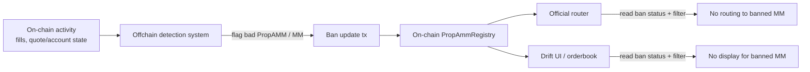

# Anti-Spoofing

## Problem

PropAMMs are an HFT primitive for Solana DeFi markets. Among their good features they also inherit the market-structure abuse patterns seen in CeFi and low-latency venues.

For Drift PropAMMs, the main abuse classes are:

- **Non-bona fide displayed liquidity.** Showing top-of-book size that is routinely cancelled or repriced once it is about to trade.
- **Taker-first behavior while advertising maker liquidity.** Using the public quote surface to influence other participants while the strategy primarily monetizes aggressive taker flow.
- **Margin-overstated quotes.** Advertising more liquidity than the linked Drift maker account can actually support. Drift-specific as margin checks are at fill-time not order placement time 

## Background Reading

### External

- CME Group, "Disruptive Practices Prohibited - Spoofing"
  - <https://www.cmegroup.com/education/courses/market-regulation/disruptive-practices-prohibited/disruptive-practices-prohibited-spoofing.html>
- CFTC enforcement example for spoofing cases
  - <https://www.cftc.gov/PressRoom/PressReleases/7988-19>
- Do and Putnins, "Detecting Layering and Spoofing in Markets"
  - <https://papers.ssrn.com/sol3/papers.cfm?abstract_id=4525036>

### Internal

- [PropAMM Interface V1](./propamm-interface-v1.md)
- [PropAMM Registry V1](./propamm-registry.md)

## Goals

Design and implement a system for monitoring and flagging problem behaviour from MMs.
Ensure the bad behavior is quickly penalized and short-lived by:

- detecting it quickly off-chain (hard)
- keeping a durable evidence trail
- and disabling the offending PropAMM from sanctioned routing paths i.e no more orderflow or dlob presence (easy)

## Offchain Soft-Bans

The preferred enforcement model is onchain signalling with offchain  **soft-ban**.

- **Policy can evolve quickly.** Detection thresholds, evidence rules, and review procedures can change without forcing matcher redesign.
- **Consistent across official surfaces.** Router and UI can share the same sanction state and make the offending MM disappear from both routing and display.
- **Safer operationally.** Reversing a mistaken soft-ban is easier than relaxing a hard on-chain block embedded in matching logic.

The main penalization will be to prevent a bad MM from receiving further orderflow or presence via Drift official sources:
- the on-chain PropAMM registry account stores ban status
- official swift routers read the registry and stop routing disabled PropAMMs
- the Drift UI / order display stack reads the same registry and hides or deactivates disabled MM liquidity

## Ban Flow
Banning is straight-forward

1) offchain system detects ban applicable
2) hot-wallet updates MMs status in registry
  2a) publish evidence bundle (?) e.g. via zip file on s3
3) swift router and dlob server filter banned MM via registry state subscription

# Build Out
---

## Program
- enable hot-wallet ix to update ban status in registry

## Swift Router
- subscribe registry, filter banned MMs

## DLOB
- subscribe registry, filter banned MMs

## Detection Pipeline

...